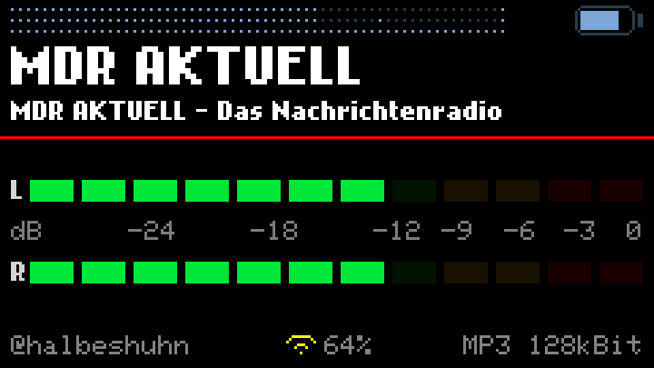

# Cardputer WebRadio

An internet radio for the M5Stack Cardputer Adv. Search for stations on the
device itself, play them, keep the ones you like — the SD card can stay where
it is.

**Start here: [v3.1.1](v3.1.1/) — the current version.** Full documentation,
source, prebuilt firmware and the render tools are inside that folder.

## Versions

Each folder is complete and self-contained: source, firmware, images and its
own README, exactly as that version was released.

| Version | Date | What changed |
|---|---|---|
| [v3.1.1](v3.1.1/) | 10 August 2026 | **Wi-Fi failures are diagnosed instead of guessed.** Every failed connection used to be reported as a wrong password, which sent people looking in the wrong place. The radio now reads the driver's disconnect reason and tells a wrong password apart from a network out of range and from a router that hands out no address. A mistyped password is no longer saved before it has worked, the connection timeout is 15 s with a second attempt, channel and BSSID from the scan speed the first one up, and the window for the `BtnG0` Wi-Fi reset is 2.5 s instead of 1. The footer names the codec next to the bitrate, and the old `L` station list — superseded by **Local list** — is gone. |
| [v3.1.0](v3.1.0/) | 9 August 2026 | **AAC and AAC+ play.** The cause was never the board: the audio library switched its AAC decoder to faad2, which asks for 22 KB in one piece per frame. Putting Helix back fixes it. The online directory no longer filters AAC away, MP3 is confirmed up to 320 kbit/s, and a decoder that runs out of memory now says so instead of rebooting. |
| [v3.0.1](v3.0.1/) | 9 August 2026 | New battery symbol in the style of the one on an iPhone, taking its colours from the volume scale. `dB` on the VU scale was lowercase. New `tools/` — renders the screens to PNG on your computer, so layout work needs no flashing. |
| [v3.0.0](v3.0.0/) | 8 August 2026 | First public release. On-device station search via radio-browser.info, local list management, WiFi setup, German and English, VU meters and spectrum analyzer. |

## Firmware

Ready-to-flash builds are attached to each
[release](https://github.com/halbeshuhn/Cardputer-WebRadio/releases), and also
live in the version folders under `firmware/`.

## Credits

Built on the work of **cyberwisk**
([M5Cardputer_WebRadio](https://github.com/cyberwisk/M5Cardputer_WebRadio))
and **WuSiU**
([WebRadio_WuSiU_Cardputer_Adv](https://github.com/WuSiU/WebRadio_WuSiU_Cardputer_Adv)),
with **schreibfaul1**'s
[ESP32-audioI2S](https://github.com/schreibfaul1/ESP32-audioI2S) doing the
decoding. Full credits in each version's README.

## License

MIT — see [LICENSE](v3.1.1/LICENSE).
