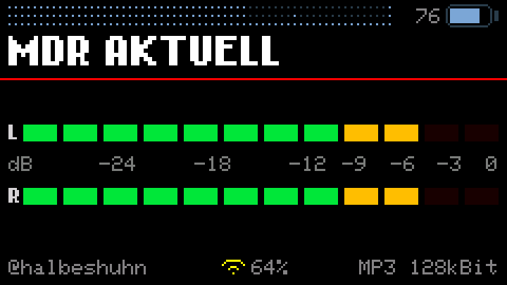
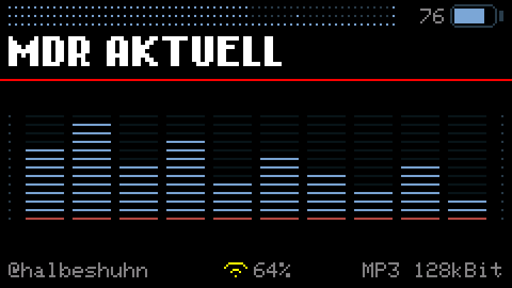
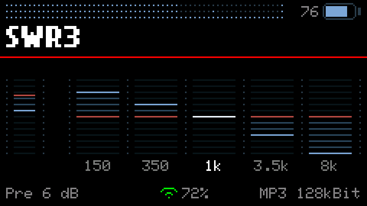
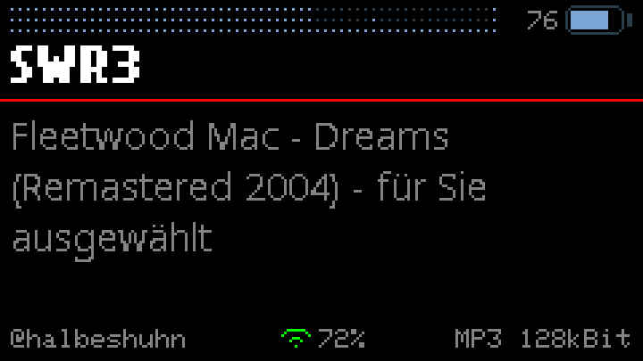
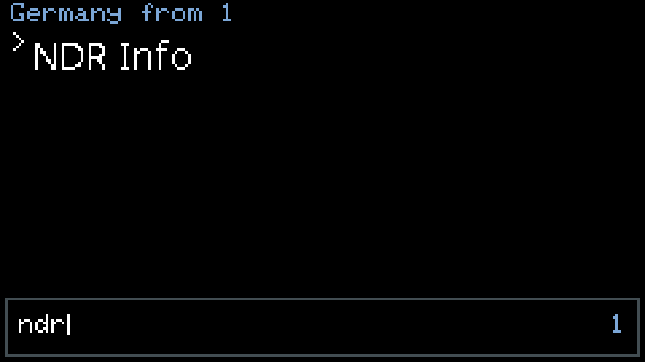
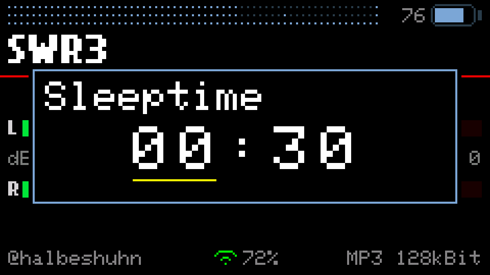
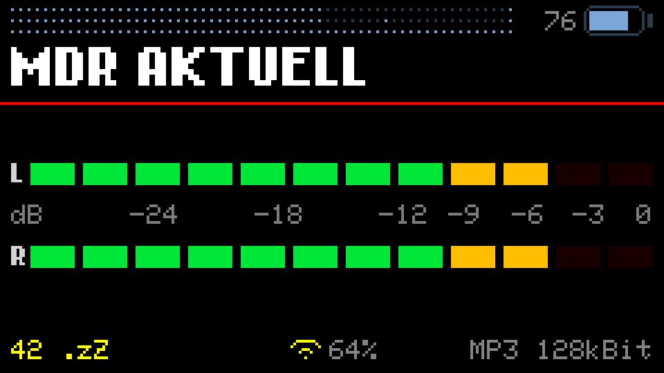

# Cardputer WebRadio

**An internet radio for the M5Stack Cardputer Adv that you never have to plug
into a computer.** Search the world's stations on the device itself, listen,
keep the ones you like — the microSD card never leaves the slot.

**[⬇ Download the latest firmware](https://github.com/halbeshuhn/Cardputer-WebRadio/releases/latest)** ·
**[📖 Full documentation](v3.4.0/)** · current version **v3.4.0**

---

## New in v3.4.0 — the three that change how it sounds

### 🔓 https stations play. Really play.

Not rewritten to `http` and hoped for. Not skipped. A **real TLS handshake**, a
real encrypted stream. Thousands of stations the directory lists as https-only
were simply unreachable before — the entire Swiss SRG family among them. Radio
SRF 3 plays. In AAC+.

Fitting a TLS connection into a device with **no PSRAM** took rebuilt ESP-IDF
libraries and a 2 KB outgoing mbedTLS buffer, measured against 44 real stations.
During an https stream the largest free memory block is down to 7 KB. It holds.

### 🔇 A dropout is silence now, not a rattle

Every Cardputer radio does this: the network stutters and the speaker starts
rattling — the same 26 ms of audio, looped, until the buffer recovers.

It was never the decoder. The I2S output repeats its last DMA block when nobody
feeds it, and nobody had told it to shut up instead. Now it falls silent, the
decoder waits until there is a real head start again, and if nothing comes back
the radio says so and reconnects on its own.

The idea of pausing the decoder rather than starving it came from
**[Heotsan](https://github.com/Heotsan)** in
[issue #3](https://github.com/halbeshuhn/Cardputer-WebRadio/issues/3).

### 🔊 The volume control finally behaves

**1.9 dB per press, all the way up.** It used to be wildly lopsided: the first
audible step was 6 dB, the last one 0.42 dB, and four presses out of twenty-six
did nothing at all.

The cause sat in the audio library, which keeps its gain in a single `uint8_t` —
64 steps between silence and full, spaced evenly in amplitude while the ear
hears in decibels. The radio no longer uses it and scales the samples itself.

**Also new:** a charge screen that shuts everything off including Wi-Fi,
keyboard shortcuts for the places you go often, scrolling names instead of
truncated ones, a fade-in at every station start — and an interface that
stopped flickering. Full list in the
**[v3.4.0 documentation](v3.4.0/)**.

---

## What it does

**Finds stations without a computer.** The directory of
[radio-browser.info](https://www.radio-browser.info/) is built in: 240 countries,
tens of thousands of stations. Type three letters and the list narrows to what
you meant — for countries and for stations alike. Press `ENTER` and it plays.

**Keeps what you like.** One menu entry writes the running station into your own
list on the SD card. No card reader, no text editor, no hunting for URLs that
turn out to be dead.

**Sounds the way you want.** A 5-band equalizer, ±6 dB at 100 Hz, 350 Hz, 1 kHz,
3.5 kHz and 10 kHz. Set once, stored on the device, active from the next start.

**Falls asleep on its own.** A sleep timer, set as `HH:MM` up to twelve hours.
The remaining time counts down in the footer; at zero the stream stops and the
display goes dark. Any key wakes it, and the station comes back.

**Speaks your script.** Chinese, Japanese, Korean, Greek, Cyrillic and Latin —
station names and stream titles are drawn in the script they arrive in, not as a
row of question marks.

**Shows what it is doing.** VU meters with peak hold, a spectrum analyzer with a
real 512-point FFT over the actual samples, the stream title in full. Nothing
here is decorative.

**Plays the awkward addresses.** A `.pls` or `.m3u` is a note with the real
stream URL on it — the radio reads the note and connects to what it finds.

**Says what went wrong.** A failed Wi-Fi connection names its reason — wrong
password, out of range, or no address from the router — instead of blaming your
password. A station that serves a playlist instead of audio says so rather than
playing noise.

---

## The screens

| | |
|---|---|
|  |  |
| VU meters with peak hold | Spectrum analyzer, VFD style |
|  |  |
| 5-band equalizer | Stream title, with umlauts and accents |
|  |  |
| 240 countries, three keystrokes | The same for stations |
|  |  |
| Sleep timer, set digit by digit | Counting down in the footer |

None of these are photographs. They are **rendered from this repository's own
source** by the tools in [`v3.4.0/tools/`](v3.4.0/tools/), which read the
coordinates, labels and colours out of the sketch — they cannot drift away from
what the device draws.

---

## Getting it onto the device

| You have | Take |
|---|---|
| **M5Burner** | the entry *Cardputer WebRadio*, or the `_merged.bin` from the release |
| **M5Launcher / SD card** | `Cardputer-WebRadio_v3.4.0.bin` — copy it to the card |
| **A blank device** | `Cardputer-WebRadio_v3.4.0_merged.bin`, written to `0x0` |
| **The Arduino IDE** | the source in [`v3.4.0/M5Cardputer_WebRadio/`](v3.4.0/M5Cardputer_WebRadio/) |

Board **M5Cardputer**, partition scheme **Huge APP**, **PSRAM off**. Building it
yourself needs four patches to the audio library and a rebuild of the ESP-IDF
libraries — all of it documented in
[`v3.4.0/library-patch/`](v3.4.0/library-patch/). Flashing the prebuilt images
needs none of that. Details and the full key map are in the
**[documentation for v3.4.0](v3.4.0/)**.

---

## If a station in your list has no logo

Since v3.3.0 the radio fetches a station's logo and keeps it on the card. It can
only do that for stations it has an address for, and that address comes from the
online directory — so a station that lives **only** in your own
`station_list.txt` keeps the placeholder tower for good.

You can give it one by hand. This runs in your browser, installs nothing, and
uploads nothing:

**[⇢ Station logo → .565](https://halbeshuhn.github.io/Cardputer-WebRadio/v3.4.0/tools/logo565.html)**

Paste the stream URL, drop an image in, move and scale it into the square, press
the button. The file arrives in your downloads named `A1B2C3D4.565` — copy it to
`/logos/` on the card, and the station has its picture from the next start.

Both halves are easy to get wrong by hand, so the page does them for you: the
name is the FNV-1a hash of the stream URL, exactly as the device computes it,
and the pixels are RGB565 little-endian at 76 × 76, 11,552 bytes. The reasoning
and the ffmpeg command for doing it yourself are in
[`v3.4.0/tools/`](v3.4.0/tools/README.md).

---

## Honest limits

TLS works since v3.4.0, and it uses nearly everything the device has: during an
https stream the largest free block is down to 7–9 KB. It took rebuilt ESP-IDF
libraries with a 2 KB outgoing mbedTLS buffer to get there, so building the
source yourself is more work than it used to be. HLS stations are recognised and
skipped instead of played as noise. AAC+ plays its base layer, because SBR needs
memory this device does not have. The output is mono: the Cardputer Adv has a
mono codec, at the speaker and at the headphone jack alike. Arabic, Hebrew and
Thai need a text engine that is not there.

All of it is measured, not guessed, and written down in the
[documentation](v3.4.0/#limitations-and-why).

---

## Versions

Every version keeps its own folder with its own source, firmware and README —
exactly as it was released.

| Version | Date | What changed |
|---|---|---|
| **[v3.4.0](v3.4.0/)** | 22 August 2026 | **https over real TLS, and dropouts that fall silent instead of rattling.** The Swiss SRG family and everything else https-only now plays; the interface stopped flickering; a charge screen, keyboard shortcuts, scrolling names, a fade-in at every station start — and 27 KB less flash than before. |
| [v3.3.0](v3.3.0/) | 17 August 2026 | **Station logos, a sleep timer, and https stations play.** An info screen, playlists resolved instead of refused, 59 KB of memory recovered, and the Wi-Fi failure some users hit under M5Launcher is fixed. |
| [v3.2.0](v3.2.0/) | 13 August 2026 | **The world, searchable.** 240 countries instead of 42, a search field for countries and stations, foreign scripts displayed, a 5-band equalizer, playlists recognised. |
| [v3.1.2](v3.1.2/) | 11 August 2026 | A new audio layer, and the reboots are gone. |
| [v3.1.1](v3.1.1/) | 10 August 2026 | Wi-Fi failures are diagnosed instead of guessed. |
| [v3.1.0](v3.1.0/) | 9 August 2026 | AAC and AAC+ play. |
| [v3.0.1](v3.0.1/) | 9 August 2026 | New battery symbol, and the render tools. |
| [v3.0.0](v3.0.0/) | 8 August 2026 | First public release. |

---

## Credits

Built on the work of **cyberwisk**
([M5Cardputer_WebRadio](https://github.com/cyberwisk/M5Cardputer_WebRadio)) and
**WuSiU**
([WebRadio_WuSiU_Cardputer_Adv](https://github.com/WuSiU/WebRadio_WuSiU_Cardputer_Adv)),
with **earlephilhower**'s
[ESP8266Audio](https://github.com/earlephilhower/ESP8266Audio) doing the
decoding, **schreibfaul1**'s
[ESP32-audioI2S](https://github.com/schreibfaul1/ESP32-audioI2S) before that,
the station directory of [radio-browser.info](https://www.radio-browser.info/),
and the CJK fonts from M5Stack's M5GFX. The rebuffering idea in v3.4.0 came from
**Heotsan** in [issue #3](https://github.com/halbeshuhn/Cardputer-WebRadio/issues/3).
Full credits in each version's README.

## License

MIT — see [LICENSE](v3.4.0/LICENSE).
