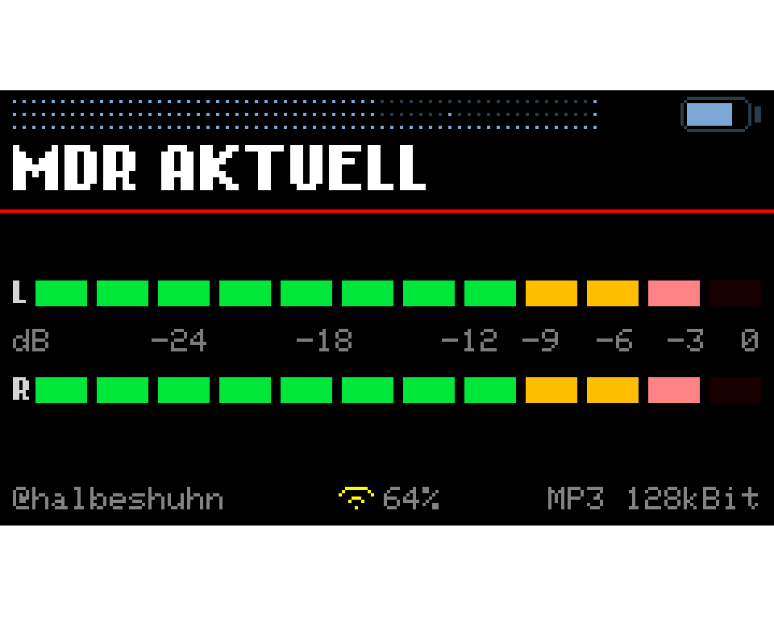
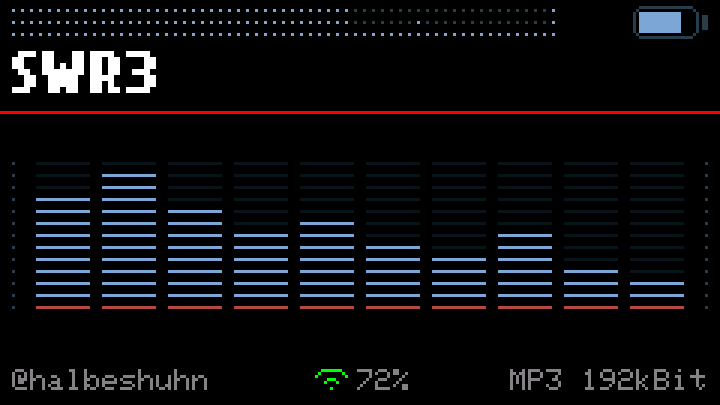
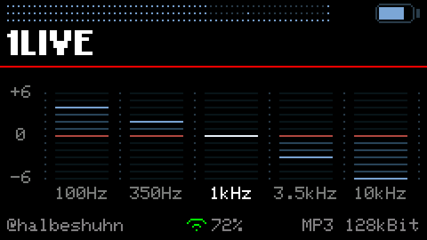
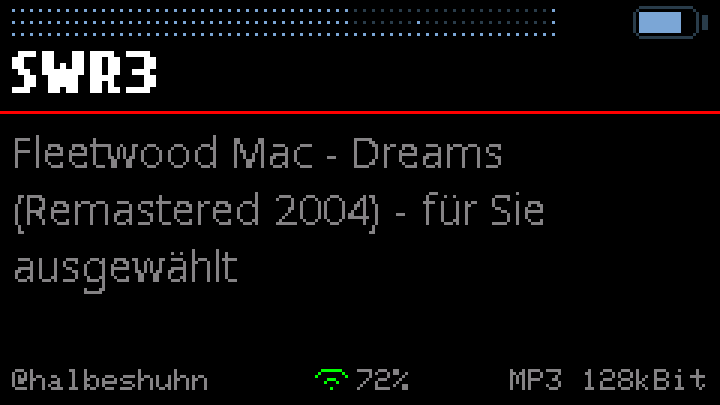
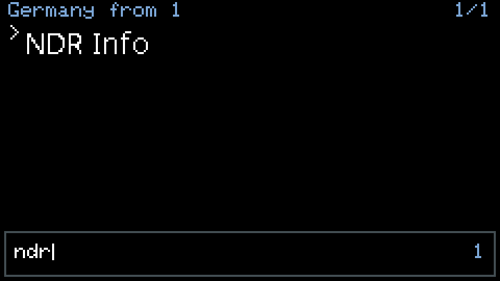

# Cardputer WebRadio

**An internet radio for the M5Stack Cardputer Adv that you never have to plug
into a computer.** Search the world's stations on the device itself, listen,
keep the ones you like — the microSD card never leaves the slot.

**[⬇ Download the latest firmware](https://github.com/halbeshuhn/Cardputer-WebRadio/releases/latest)** ·
**[📖 Full documentation](v3.2.0/)** · current version **v3.2.0**

---

## What it does

**Finds stations without a computer.** The directory of
[radio-browser.info](https://www.radio-browser.info/) is built in: 240 countries,
tens of thousands of stations. Type three letters and the list narrows to what
you meant — for countries and for stations alike. Press `ENTER` and it plays.

**Keeps what you like.** One menu entry writes the running station into your own
list on the SD card. No card reader, no text editor, no hunting for URLs that
turn out to be dead.

**Sounds the way you want.** A 5-band equalizer, ±6 dB at 100 Hz, 350 Hz, 1 kHz,
3.5 kHz and 10 kHz. Set once, stored on the device, active from the next start.

**Speaks your script.** Chinese, Japanese, Korean, Greek, Cyrillic and Latin —
station names and stream titles are drawn in the script they arrive in, not as a
row of question marks.

**Shows what it is doing.** VU meters with peak hold, a spectrum analyzer with a
real 512-point FFT over the actual samples, the stream title in full. Nothing
here is decorative.

**Says what went wrong.** A failed Wi-Fi connection names its reason — wrong
password, out of range, or no address from the router — instead of blaming your
password. A dead stream reconnects by itself. A station that serves a playlist
instead of audio says so rather than playing noise.

---

## The screens

| | |
|---|---|
|  |  |
| VU meters with peak hold | Spectrum analyzer, VFD style |
|  |  |
| 5-band equalizer | Stream title, with umlauts and accents |
|  |  |
| 240 countries, three keystrokes | The same for stations |

None of these are photographs. They are **rendered from this repository's own
source** by the tools in [`v3.2.0/tools/`](v3.2.0/tools/), which read the
coordinates, labels and colours out of the sketch — they cannot drift away from
what the device draws.

---

## Getting it onto the device

| You have | Take |
|---|---|
| **M5Burner** | the entry *Cardputer WebRadio*, or the `_merged.bin` from the release |
| **M5Launcher / SD card** | `Cardputer-WebRadio_v3.2.0.bin` — copy it to the card |
| **A blank device** | `Cardputer-WebRadio_v3.2.0_merged.bin`, written to `0x0` |
| **The Arduino IDE** | the source in [`v3.2.0/M5Cardputer_WebRadio/`](v3.2.0/M5Cardputer_WebRadio/) |

Board **M5Cardputer**, partition scheme **Huge APP**, **PSRAM off**. No library
patches. Details and the full key map are in the
**[documentation for v3.2.0](v3.2.0/)**.

---

## Honest limits

No https — mbedTLS wants 32 KB this device does not have. HLS stations are
recognised and skipped instead of played as noise. AAC+ plays its base layer,
because SBR needs PSRAM. The output is mono: the Cardputer Adv has a mono codec,
at the speaker and at the headphone jack alike. Arabic, Hebrew and Thai need a
text engine that is not there.

All of it is measured, not guessed, and written down in the
[documentation](v3.2.0/#limitations-and-why).

---

## Versions

Every version keeps its own folder with its own source, firmware and README —
exactly as it was released.

| Version | Date | What changed |
|---|---|---|
| **[v3.2.0](v3.2.0/)** | 13 August 2026 | **The world, searchable.** 240 countries instead of 42, a search field for countries and stations, foreign scripts displayed, a 5-band equalizer, playlists recognised. |
| [v3.1.2](v3.1.2/) | 11 August 2026 | A new audio layer, and the reboots are gone. |
| [v3.1.1](v3.1.1/) | 10 August 2026 | Wi-Fi failures are diagnosed instead of guessed. |
| [v3.1.0](v3.1.0/) | 9 August 2026 | AAC and AAC+ play. |
| [v3.0.1](v3.0.1/) | 9 August 2026 | New battery symbol, and the render tools. |
| [v3.0.0](v3.0.0/) | 8 August 2026 | First public release. |

---

## Credits

Built on the work of **cyberwisk**
([M5Cardputer_WebRadio](https://github.com/cyberwisk/M5Cardputer_WebRadio)) and
**WuSiU**
([WebRadio_WuSiU_Cardputer_Adv](https://github.com/WuSiU/WebRadio_WuSiU_Cardputer_Adv)),
with **earlephilhower**'s
[ESP8266Audio](https://github.com/earlephilhower/ESP8266Audio) doing the
decoding, **schreibfaul1**'s
[ESP32-audioI2S](https://github.com/schreibfaul1/ESP32-audioI2S) before that,
the station directory of [radio-browser.info](https://www.radio-browser.info/),
and the CJK fonts from M5Stack's M5GFX. Full credits in each version's README.

## License

MIT — see [LICENSE](v3.2.0/LICENSE).
