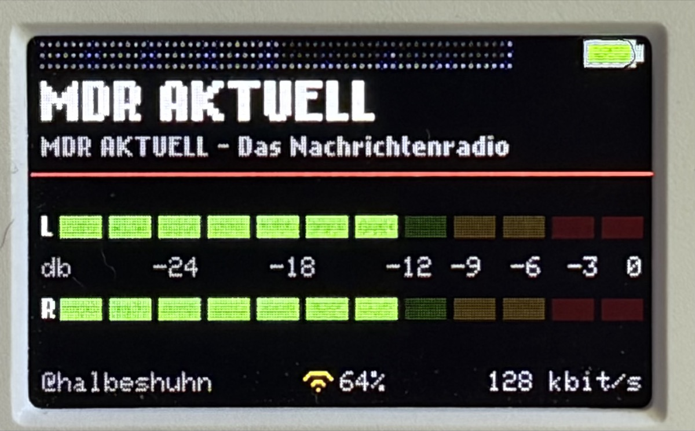
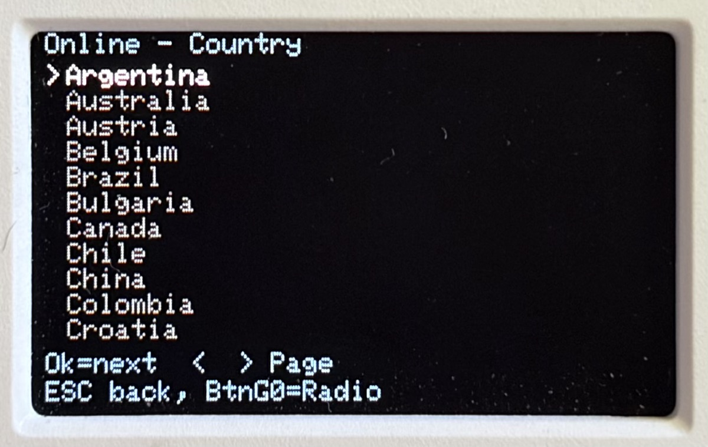
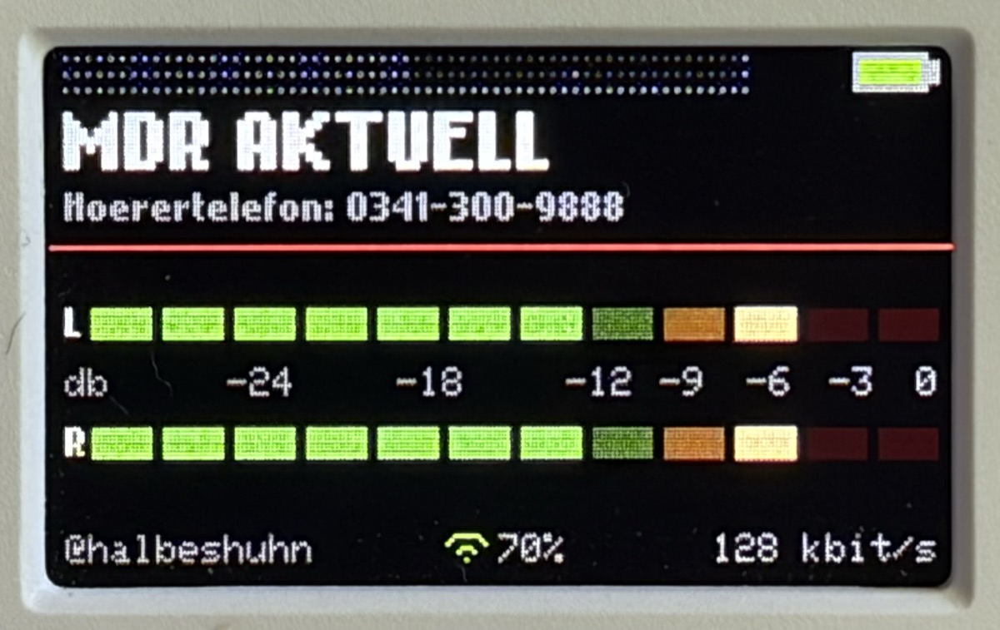
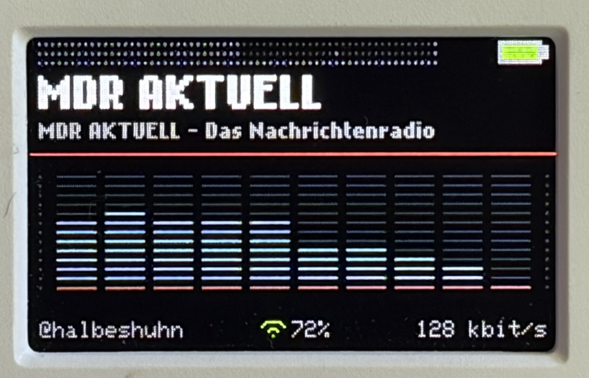
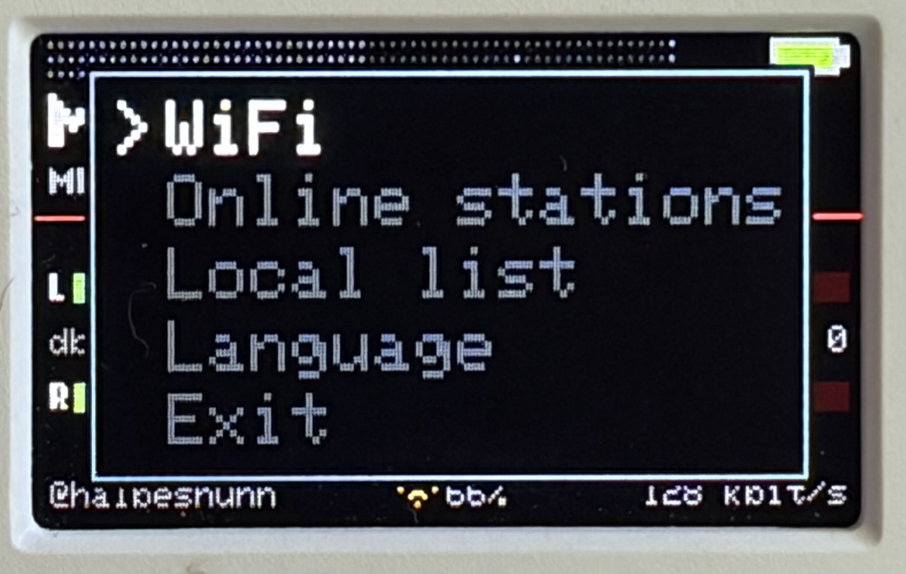

# Cardputer WebRadio

An internet radio for the **M5Stack Cardputer Adv** — one that you never have
to plug into a computer to add a station.



Based on [WuSiU/WebRadio_WuSiU_Cardputer_Adv](https://github.com/WuSiU/WebRadio_WuSiU_Cardputer_Adv),
which is based on [cyberwisk/M5Cardputer_WebRadio](https://github.com/cyberwisk/M5Cardputer_WebRadio).

---

## The point: the SD card can stay where it is

Every Cardputer radio I know of works like this. You want a new station, so
you power the device down, pull the microSD card, find a card reader, search
the web for a stream URL that actually works, paste it into a text file, put
the card back, and hope you got the format right. Repeat for every station.

**This one has the station directory built in.**

Press `BtnG0` → **Online stations**, and you are browsing
[radio-browser.info](https://www.radio-browser.info/) — 42 countries, with
Germany and the United States broken down by region. Pick a station, press
`ENTER`, it plays. If you like it, open the menu again and choose
**Save station**: it lands in your own list on the SD card, written by the
device itself.

No cable. No card reader. No hunting for URLs that turn out to be dead.



The directory is filtered so that what you see is what this device can
actually play — no https, no AAC, no dead links. The
[limitations section](#limitations-and-why) explains why those three matter so
much here.

The same applies to Wi-Fi: scan, pick, type the password, done. Up to five
networks are remembered, and you can replace or delete them from the menu. The
device never needs recompiling to move to a new network.

---

## Everything else it does

- **Local station list** from the SD card, up to 20 entries, fully editable on
  the device — play, add, delete, all from the menu.
- **Two real visualizations.** The VU meters come from the decoder's own level
  data; the spectrum analyzer is a 512-point radix-2 FFT with a Hann window over
  the actual PCM samples, in 10 logarithmic bands. Nothing here is decorative —
  the original code filled the display with `random()`.
- **German and English**, switchable at runtime, remembered across restarts.
- **Stream monitoring.** A stream that connects but delivers nothing is
  reported instead of failing silently.

---

## Screenshots

| | |
|---|---|
|  |  |
| VU meters with peak hold | Spectrum analyzer, VFD style |



The system menu, on `BtnG0`. This is where everything happens that used to
require a computer.

---

## Hardware

- **M5Stack Cardputer Adv** — this is the model **without PSRAM**, which shapes
  much of what follows.
- microSD card (optional) with `station_list.txt` in the root directory.
- A Wi-Fi network on 2.4 GHz.

---

## Quick start: just flash it

Two prebuilt images are in [`firmware/`](firmware/):

| File | Size | Use with |
|---|---|---|
| `Cardputer-WebRadio_v3.0.0.bin` | 1.7 MB | SD card / M5Launcher — application only |
| `Cardputer-WebRadio_v3.0.0_merged.bin` | 4.2 MB | M5Burner, ESP Web Flasher — complete image, write to `0x0` |

On first start the device scans for Wi-Fi networks and asks for a password.
The interface starts in English; switch under **BtnG0 → Language**.

---

## Building it yourself

### 1. Board settings

| Setting | Value |
|---|---|
| Board | **M5Cardputer** |
| Partition Scheme | **Huge APP (3MB No OTA / 1MB SPIFFS)** |
| PSRAM | **Disabled** |

The partition scheme is mandatory — the sketch is about 1.68 MB. PSRAM must
stay disabled: the Cardputer Adv has none, and enabling it only costs 72 KB of
program space.

### 2. Libraries

- [ESP32-audioI2S](https://github.com/schreibfaul1/ESP32-audioI2S) by schreibfaul1
- M5Cardputer / M5Unified / M5GFX

### 3. Apply the library patch — required

**Without this patch the device can crash and lose its stored Wi-Fi
credentials.** See [`library-patch/`](library-patch/) for the full reasoning and
the measurements. In short:

Some stations are listed as `http` but redirect to `https` when you press play.
The audio library then brings up mbedTLS, which without PSRAM allocates about
32 KB — on a device that has 13 to 25 KB free. Measured on hardware, free heap
dropped to **996 bytes**. At that point *any* allocation in *any* task can
fail, including the NVS reads that load your saved Wi-Fi networks.

The patch refuses https when there is no PSRAM, the same way the library
already refuses FLAC. Devices *with* PSRAM are unaffected.

```bash
cd ~/Documents/Arduino/libraries/ESP32-audioI2S-master/src
patch -p0 < /path/to/library-patch/audio-https-psram.patch
```

A library update overwrites the patch. Reapply it afterwards.

### 4. Compile

Open `M5Cardputer_WebRadio/M5Cardputer_WebRadio.ino` in the Arduino IDE, or
from the command line:

```bash
arduino-cli compile --fqbn m5stack:esp32:m5stack_cardputer:PartitionScheme=huge_app M5Cardputer_WebRadio
```

---

## Controls

| Key | Function |
|---|---|
| ← / → | previous / next station |
| ↑ / ↓ | volume |
| `M` | mute |
| `R` | reconnect the stream |
| `F` | display: off → VU → VU+peak → spectrum → off |
| `B` | brightness |
| `L` | station list from SD, `ENTER` selects |
| **BtnG0** | system menu |

The Cardputer's arrow keys send the printed characters, not cursor codes —
hence the checks for `;` `.` `,` `/` in the source.

### System menu (BtnG0)

Up/down selects, `ENTER` opens, `ESC` (the `` ` `` key) goes back one level.
**BtnG0 returns to the radio from anywhere.**

| Entry | Function |
|---|---|
| **WiFi → Info** | SSID, IP and RSSI |
| **WiFi → Scan+Connect** | scan, pick, connect. Known networks are tried silently first |
| **WiFi → Saved** | `ENTER` connects, `BS` deletes the marked entry |
| **WiFi → Reset** | clears all networks, rescans, reconnects — without restarting |
| **Online stations** | the station directory, see below |
| **Local list** | the SD stations. `ENTER` plays, `BS` deletes from list *and* file |
| **Save station** | appears only while an online station is playing. Adds it to the local list |
| **Language** | German / English, remembered across restarts |

#### Finding a station and keeping it

This is the part worth reading, because it replaces the whole card-reader
routine.

**1. Country.** `BtnG0` → **Online stations** gives you 42 countries in
alphabetical order. ↑ / ↓ moves one line, ← / → jumps a whole screen — useful,
since the list is four screens long.

**2. Region.** For **Germany** and the **United States** the next level is the
16 federal states or the 50 states, plus **All**. Every other country goes
straight to its stations.

**3. Station.** Sorted by popularity, eleven per page, ← / → fetches the next
page from the service. `ENTER` plays it immediately — no saving needed to
listen.

**4. Keep it.** While an online station is playing, the menu grows an extra
entry: **Save station**. One press writes it into `station_list.txt` on the SD
card, at the next free one of the 20 slots. Duplicates are detected by URL, not
by name, so the same stream cannot end up in the list twice under two different
names.

To remove one again: **Local list**, mark it, `BS`. Gone from the list and from
the file.

A note on what you are browsing: the query is filtered to `MP3`, no `https`,
and dead entries hidden. That is not arbitrary — those are exactly the three
things that this device cannot handle, and the reasons are in
[Limitations](#limitations-and-why). The practical effect is that stations you
can see are stations that will play.

The stream is briefly paused while a page is fetched. That is deliberate: the
socket has to be released to free enough memory for the request.

---

## The station list

`station_list.txt` in the **root directory of the SD card**, one station per
line, name and URL separated by a comma:

```
Radio Bob,http://streams.radiobob.de/bob-national/mp3-192/mediaplayer
MDR Aktuell,http://mdr-284340-0.cast.mdr.de/mdr/284340/0/mp3/high/stream.mp3
```

Up to 20 stations. If the file is missing, a single built-in station is used.

**You do not have to write this file by hand.** It is far easier to find
stations with the [built-in directory](#finding-a-station-and-keeping-it) and
let the device write them. Editing the file yourself is for when you already
know a URL that the directory does not have.

**The file is rewritten completely** whenever you save or delete a station on
the device. Comment lines and lines without a comma will not survive that —
the sketch knows only this one format.

**Use `http://`, not `https://`** — see the limitations below.

---

## Limitations, and why

This device has **no PSRAM**. The audio library places its decoder and stream
buffers in internal RAM, leaving roughly **13 to 25 KB of free heap** during
playback. That single fact explains everything below.

### https does not work

Not a bug, and not fixable in the sketch: mbedTLS needs about 32 KB for its
record buffers. The station directory is therefore queried with
`is_https=false`, and the library patch above catches the redirect case.

### AAC does not work

The library uses **faad2** for AAC. In `neaacdec.cpp` there are 71 calls to
`faad_malloc` and 2 of them check the result for NULL. Without PSRAM the
allocator falls back to `malloc()`, the first tight allocation returns NULL,
and the device reboots.

The directory is therefore queried with `codec=MP3`. Note that a station's
*name* is no guide — "ABC News Radio MP3" is served as AAC+.

**This only protects the online browser.** An AAC station you put into
`station_list.txt` by hand will still crash the device.

### High bitrates stutter

The input buffer is 13,951 bytes without PSRAM. That is 0.87 s of audio at
128 kbit/s, but only 0.44 s at 256 kbit/s — not enough to ride out network
jitter, especially on distant servers. **128 kbit/s or lower is the sweet
spot**; 192 usually works; 256 and above will drop out.

### Fragmentation

Free heap and the largest *contiguous* block are two different numbers. With
20 KB free, the largest block is often only 7–12 KB. Anything that allocates
large blocks can fail while "enough" memory appears to be free.

---

## Notes for anyone modifying this

**Never draw from the audio library's callbacks.** The library runs its own
FreeRTOS task, so `audio_showstation()`, `audio_id3data()` and
`audio_showstreamtitle()` execute there — not in `loop()`. M5GFX is not
thread-safe and allocates while drawing; doing this corrupted the heap and
produced a crash minutes later, in an unrelated task. The rule: a callback
stores into a buffer and sets a flag, `loop()` does the drawing.

**Check the heap before adding static buffers.** Increasing two buffers by
3.4 KB was once enough to stop the first stream from starting at all.

**Screen text budgets.** The system menu and message boxes use `Font0` at
double size, 12 px per character: 15 characters per menu entry, 16 per message
line. The full-screen lists use `Font0` at single size, 6 px per character, so
38 characters fit. The radio screen uses the proportional Nokia font — measure
it, don't count characters.

**Serial diagnostics** are available: set `DEBUG_SERIAL` to 1 in the sketch.
You get free heap, minimum heap and largest contiguous block every 1500 ms,
plus the audio library's own messages.

---

## Credits

- **cyberwisk** — the original [M5Cardputer_WebRadio](https://github.com/cyberwisk/M5Cardputer_WebRadio)
- **WuSiU** — [WebRadio_WuSiU_Cardputer_Adv](https://github.com/WuSiU/WebRadio_WuSiU_Cardputer_Adv), the Cardputer Adv version this one grew out of
- **schreibfaul1** — [ESP32-audioI2S](https://github.com/schreibfaul1/ESP32-audioI2S)
- **radio-browser.info** — the free station directory, no key, no registration
- **Zeh Fernando** — "Nokia Cellphone FC Small", the pixel font

## License

MIT — see [LICENSE](LICENSE).
