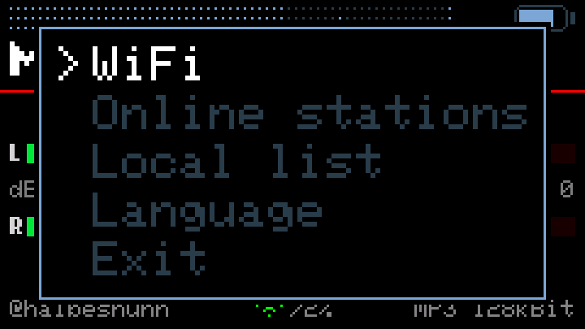

# Cardputer WebRadio v3.2.0

An internet radio for the **M5Stack Cardputer Adv** — one that you never have
to plug into a computer to add a station.

Based on [WuSiU/WebRadio_WuSiU_Cardputer_Adv](https://github.com/WuSiU/WebRadio_WuSiU_Cardputer_Adv),
which is based on [cyberwisk/M5Cardputer_WebRadio](https://github.com/cyberwisk/M5Cardputer_WebRadio).

---

## The point: the SD card can stay where it is

Every Cardputer radio I know of works like this. You want a new station, so you
power the device down, pull the microSD card, find a card reader, search the web
for a stream URL that actually works, paste it into a text file, put the card
back, and hope you got the format right. Repeat for every station.

**This one has the station directory built in — and a search field.**

Press `BtnG0` → **Online stations**, type three letters, and you are looking at
the stations you meant. 240 countries, every station
[radio-browser.info](https://www.radio-browser.info/) knows. Pick one, press
`ENTER`, it plays. Like it? Open the menu again and choose **Save station**: it
lands in your own list on the SD card, written by the device itself.

| | |
|---|---|
|  |  |
| 240 countries… | …three keystrokes later |

The same for stations: type, and the directory searches — on the server, not
here, because only eleven names fit in this device's memory at a time.

| | |
|---|---|
|  |  |

---

## New in 3.2.0

- **A 5-band equalizer**, ±6 dB at 100 Hz, 350 Hz, 1 kHz, 3.5 kHz and 10 kHz,
  stored on the device and active from the next start.
- **Foreign scripts are displayed.** Chinese, Japanese, Korean, Greek, Cyrillic —
  station names and stream titles arrive as UTF-8 and are drawn with the
  matching font. Until now everything beyond Latin-1 became a row of `?`.
- **240 countries instead of 42**, with a **search field** on the country page.
- **A search field for stations**, invisible until you type.
- **Playlists are recognised** instead of played as noise: a station that serves
  HLS or `.m3u` says so in the footer, and HLS stations are skipped when the
  list is read — in Taiwan that is 18 % of them.
- The regional subdivision is gone. The directory leaves the state empty for
  more than half of all German stations, so it hid more than it showed.

---

## The screens

| | |
|---|---|
|  |  |
| VU meters with peak hold | Spectrum analyzer, VFD style |
|  |  |
| 5-band equalizer | Stream title, with umlauts and accents |

These are not photographs. They are rendered from this repository's own source
by [`tools/`](tools/README.md), which reads the coordinates, labels and colours
out of the sketch — so they cannot drift away from what the device draws.

---

## Operating it

The Cardputer has no cursor keys. The four keys `;` `.` `,` `/` are the arrows,
and this text calls them **up, down, left, right**. `` ` `` is **ESC**.

### Radio screen

| Key | Does |
|---|---|
| **up / down** | volume |
| **left / right** | previous / next station in the local list |
| **`M`** | mute |
| **`F`** | next display: off → VU → VU with peak → spectrum → **equalizer** → off |
| **`B`** | display brightness |
| **`R`** | play `/mp3` files from the SD card |
| **`BtnG0`** | system menu |

With the display **off**, the stream title stands below the red rule — four
lines, wrapped at word boundaries. It waits while the input buffer is low: the
sound has priority.

### Equalizer

Reached with `F`, right after the spectrum.

| Key | Does |
|---|---|
| **up / down** | raise or lower the selected band, 1 dB per press |
| **left / right** | choose a band |
| **`0`** | all bands back to zero |
| **`F`** | leave, and save |
| **`M`, `B`** | still work |

At the ends nothing wraps around: the selection stops at 100 Hz and at 10 kHz,
the value at +6 and −6 dB. The setting is written to NVS when you leave and
after two seconds without a keypress — never on every keystroke, because a
write to flash stops the loop that feeds the audio buffer.

The curve is **active immediately after switching on**. An equalizer is a
setting, not an effect you have to enable.

### System menu (`BtnG0`)

| Entry | Does |
|---|---|
| **WiFi** | scan, connect, forget; up to five networks are remembered |
| **Online stations** | the directory — see below |
| **Local list** | the stations on your SD card |
| **Save station** | appears only while an online station is playing |
| **Language** | German or English, remembered |
| **Exit** | back to the radio |

Up and down choose, `ENTER` opens, `` ` `` (ESC) closes.

### Online stations

Two levels: country, then station.

| Key | Country page | Station page |
|---|---|---|
| **up / down** | move the selection | move the selection |
| **left / right** | page back / forward | page back / forward |
| **letters, digits** | search — the list narrows as you type | search — the directory is asked |
| **BACKSPACE** | deletes one character, **nothing else** | deletes one character, **nothing else** |
| **`ENTER`** | open the country | play the station |
| **`` ` ``** (ESC) | one level back | one level back |
| **`BtnG0`** | straight back to the radio |

The search field on the station page is **invisible until you type** and
disappears when the last character is deleted; its space stays reserved so the
list does not jump. Top right stands the page number — `3/?` until the last
page has been seen, `3/12` afterwards.

Stations are sorted by popularity, so the well-known ones are on page one. That
matters for scripts you cannot type on this keyboard: nobody can enter 中文 here,
but everyone can look at the first page.

### Local list

| Key | Does |
|---|---|
| **up / down** | choose |
| **`ENTER`** | play |
| **BACKSPACE** | delete this entry |
| **`` ` ``** (ESC) | back to the menu |

The list lives in `/station_list.txt` on the SD card, one station per line as
`Name,URL`, up to 20 of them. **Save station** appends to it.

---

## Flashing

Two prebuilt images are in [`firmware/`](firmware/):

| File | Size | Use with |
|---|---|---|
| `Cardputer-WebRadio_v3.2.0.bin` | 2.9 MB | SD card / M5Launcher — application only |
| `Cardputer-WebRadio_v3.2.0_merged.bin` | 4.2 MB | M5Burner, ESP Web Flasher — write to `0x0` |

On first start the device scans for Wi-Fi networks and asks for a password.
The interface starts in English; switch under **BtnG0 → Language**.

---

## Building it yourself

| Setting | Value |
|---|---|
| Board | **M5Cardputer** |
| Partition Scheme | **Huge APP (3MB No OTA / 1MB SPIFFS)** |
| PSRAM | **Disabled** |

The partition scheme is not optional — the sketch is 2.91 MB, and the M5Launcher
gives an application 2880 KB. PSRAM must stay off: the Cardputer Adv has none,
and enabling it only costs program space.

Libraries: [ESP8266Audio](https://github.com/earlephilhower/ESP8266Audio) and the
M5 libraries (M5Cardputer, M5Unified, M5GFX). **No library patches are needed.**

---

## Limitations, and why

This device has **no PSRAM**. During playback there are roughly **20 to 30 KB of
free heap**, and the largest contiguous block is 8 to 18 KB. That single fact
explains most of what follows.

### https does not work

mbedTLS wants about 32 KB for its record buffers. The directory is therefore
queried with `is_https=false`. An http address that redirects to https simply
does not play — nothing here follows redirects, so no TLS connection is ever
attempted.

### HLS is recognised, not played

Some stations serve a playlist of small segments instead of a continuous stream.
Playing that would need a client that reloads the playlist and fetches segment
after segment. Those stations are skipped when the list is read (the directory
marks them), and if you reach one anyway, the footer says
`Playlist - not supported` instead of playing noise.

### AAC+ plays its base layer

The decoder only compiles SBR — the “+” — when PSRAM is available, because its
state is another 50 KB. AAC+ therefore plays at 22,050 Hz instead of 44,100 and
mono where parametric stereo is used. Stable, just duller. Plain AAC-LC is
unaffected.

### The output is mono

The Cardputer Adv has an ES8311, a **mono** codec — one DAC, for the speaker and
for the 3.5 mm jack alike. Both channels are averaged before output, so nothing
that a station puts hard left or right is lost. The VU meters still show both
channels: they measure before that point.

### Not every script

Chinese, Japanese, Korean, Greek, Cyrillic and Latin are covered. Arabic and
Hebrew need right-to-left, Thai and the Indic scripts need reordering and
stacking — that is a text engine, not a font, and this device does not have one.

Stream titles that arrive in a legacy encoding such as Big5 cannot be shown
either; there is no room for conversion tables. Station names in that state are
discarded rather than drawn as boxes — the correct name from the directory stays.

---

## Notes for anyone modifying this

Audio callbacks run in the loop task here, so drawing from them is allowed — but
`ConsumeSample()` **must not modify the sample it is handed**. The library offers
the same sample again when it did not fit into the I2S buffer, and a second pass
over it was audible as a fine crackle.

Round, never truncate, when you scale samples.

`tools/` renders every screen on your computer, reading the coordinates out of
the sketch. Change a `#define`, render again, and you see it — no flashing
needed. See [`tools/README.md`](tools/README.md).

---

## Credits

- **cyberwisk** — [M5Cardputer_WebRadio](https://github.com/cyberwisk/M5Cardputer_WebRadio), the original
- **WuSiU** — [WebRadio_WuSiU_Cardputer_Adv](https://github.com/WuSiU/WebRadio_WuSiU_Cardputer_Adv), the version this one grew out of
- **earlephilhower** — [ESP8266Audio](https://github.com/earlephilhower/ESP8266Audio), which does the decoding since 3.1.2
- **schreibfaul1** — [ESP32-audioI2S](https://github.com/schreibfaul1/ESP32-audioI2S), which carried this radio up to 3.1.1
- **radio-browser.info** — the station directory
- **M5Stack** — M5Unified, M5GFX and the efont CJK fonts

## License

MIT — see [LICENSE](LICENSE).
