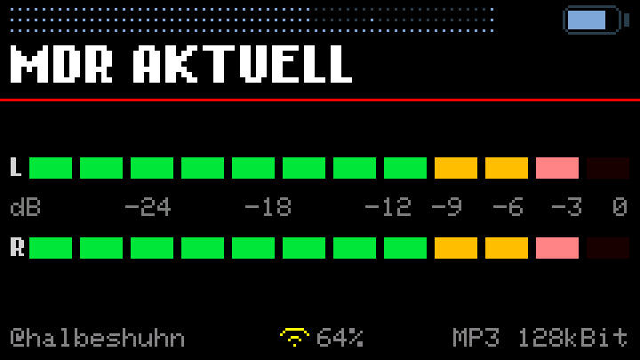
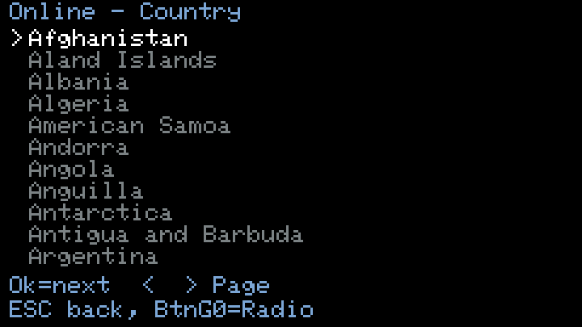
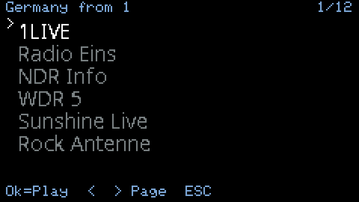
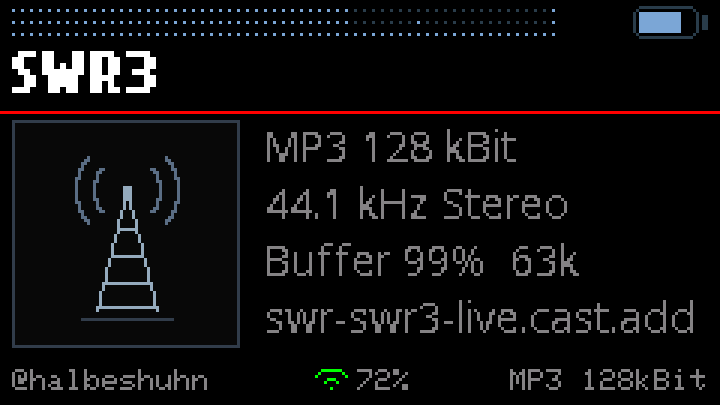
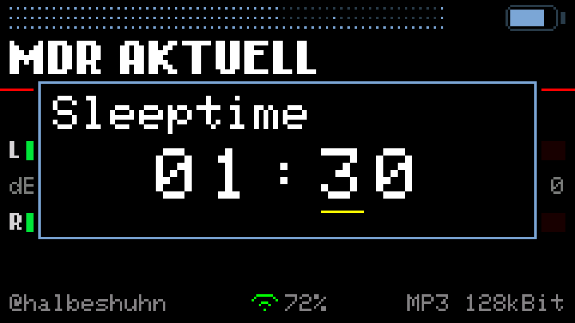
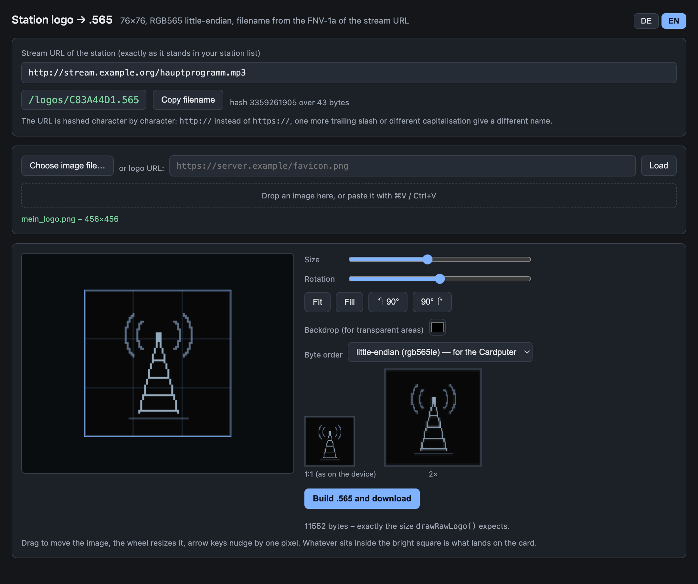
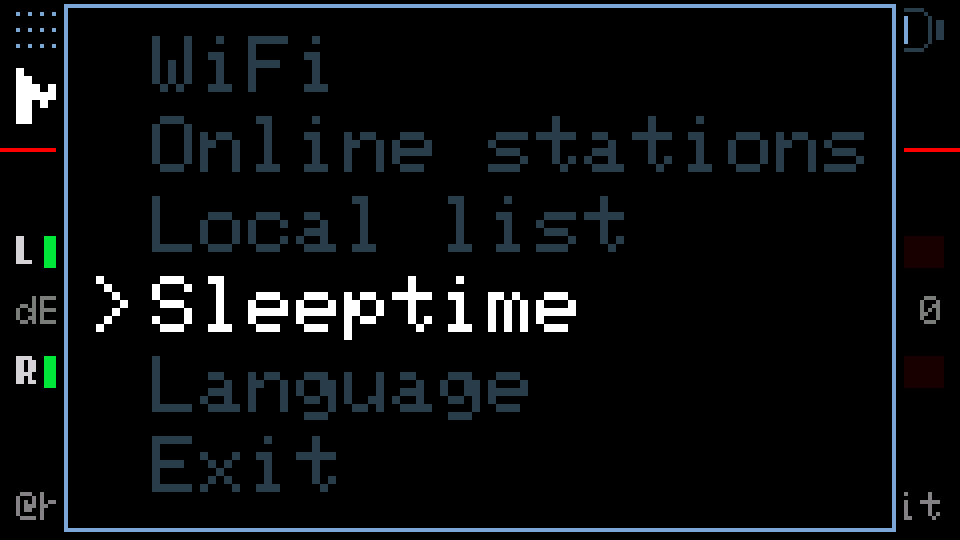
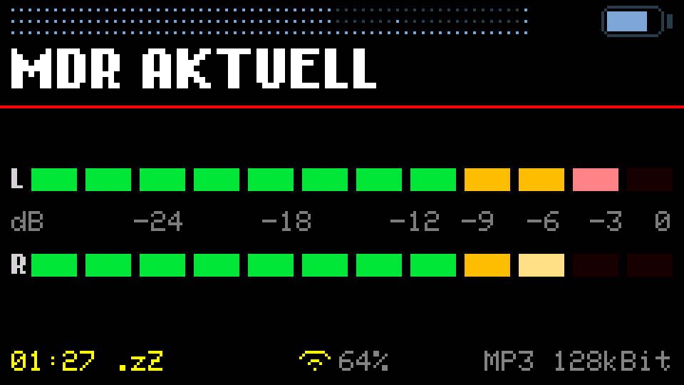

# Cardputer WebRadio v3.3.0

An internet radio for the **M5Stack Cardputer Adv** — one that you never have
to plug into a computer to add a station.

Based on [WuSiU/WebRadio_WuSiU_Cardputer_Adv](https://github.com/WuSiU/WebRadio_WuSiU_Cardputer_Adv),
which is based on [cyberwisk/M5Cardputer_WebRadio](https://github.com/cyberwisk/M5Cardputer_WebRadio).

---

## The point: the SD card can stay where it is

Every Cardputer radio I know of works like this. You want a new station, so you
power the device down, pull the microSD card, find a card reader, search the web
for a stream URL that actually works, paste it into a text file, put the card
back, and hope you got the format right. Repeat for every station.

**This one has the station directory built in — and a search field.**

Press `BtnG0` → **Online stations**, type three letters, and you are looking at
the stations you meant. 240 countries, every station
[radio-browser.info](https://www.radio-browser.info/) knows. Pick one, press
`ENTER`, it plays. Like it? Open the menu again and choose **Save station**: it
lands in your own list on the SD card, written by the device itself.

| | |
|---|---|
|  |  |
| 240 countries… | …three keystrokes later |

The same for stations: type, and the directory searches — on the server, not
here, because only eleven names fit in this device's memory at a time.

| | |
|---|---|
|  |  |

---

## New in 3.3.0

- **A sleep timer.** Menu entry *Sleeptime*, set as `HH:MM` up to twelve hours,
  digit by digit. While it runs, the remaining time counts down in the footer
  in yellow. At zero the stream stops and the display goes dark; any key wakes
  the device, restores the brightness it had and reconnects the station.
- **Playlists are resolved instead of refused.** `.pls` and plain `.m3u` are
  a note with the real stream URL on it, so the radio now reads that note and
  connects to what it finds — the kind of address stations hand out on their own
  pages. HLS keeps its own message, because a segment list has no stream URL in
  it to find.
- **https stations play.** The directory filter is gone: an `https` address is
  rewritten to `http` and simply tried. Measured on the 80 most-clicked German
  stations the directory files as https, **80 of 80** deliver the same audio over
  plain http. Where it genuinely fails, the footer says `https not work`.
- **Station logos.** The device fetches the station's logo once, keeps it on the
  SD card in `/logos`, and shows it on the new info screen. Fetching happens
  while the sound is off, in the one moment the heap is clean.
- **An info screen.** Press `F` past the spectrum analyzer: codec, bitrate,
  sample rate, channels, buffer fill, largest free memory block, and the host
  the audio actually comes from — the resolved one, not the one in your list.
- **59 KB of memory back.** SBR — the “+” in AAC+ — was compiled into the decoder
  and never used, because this device has always played the base layer only.
  Taking it out freed 59 KB, and that is what made the logos possible in the
  first place. It needs a one-time patch to the audio library, see
  [`library-patch/`](library-patch/).
- **The system menu scrolls** — it has to, now that a seventh entry can appear.

### Fixed in 3.3.0

Every one of these came from a report in
[r/CardPuter](https://www.reddit.com/r/CardPuter/) or from testing real stations
against the release. Thanks to everyone who took the time to write them up.

- **Wi-Fi failed for some users under M5Launcher.** Three people reported the
  radio not connecting although the credentials were right. Cause: M5Launcher up
  to 2.8.0 lays out a smaller shared NVS area than usual (`0x4000` instead of
  `0x5000`), and the Wi-Fi driver stores its own configuration there while
  connecting. The radio now calls `WiFi.persistent(false)` before its first
  Wi-Fi call, so the driver keeps its configuration in RAM and never touches
  that area — the credentials are ours to store, and we do it ourselves.
  A sixth failure message was added for the case where the driver refuses to
  start at all, instead of waiting 15 seconds and then blaming the network.
- **Stations that serve a playlist played as noise.** Reported under the v3.2.0
  announcement. `.pls` and plain `.m3u` are now resolved; SomaFM and friends
  play. HLS keeps its own message.
- **Stations whose address redirects to https did not play.** Reported for NTS
  Radio (`stream-relay-geo.ntslive.net`), which answers a plain-http request
  with a redirect to an https host — which in turn redirects to a plain-http
  node that serves the audio. The address itself was never the problem, the
  redirect was. Such a redirect is now rewritten to `http` and followed.
- **The first play of a new station could show a false `https not work`,**
  complete with a short break in the sound a few seconds later. The stream
  watchdog's five-second clock was started before the logo was fetched, so a
  slow logo download used up the budget meant for connecting. The clock now
  starts after the logo is in.
- **Stations quoted their playlist entries** (`File1="http://…"`) and were
  rejected. Found while testing real stations, not while reading code.

### Before that, in 3.2.0

- **A 5-band equalizer**, ±6 dB at 100 Hz, 350 Hz, 1 kHz, 3.5 kHz and 10 kHz,
  stored on the device and active from the next start.
- **Foreign scripts are displayed.** Chinese, Japanese, Korean, Greek, Cyrillic —
  station names and stream titles arrive as UTF-8 and are drawn with the
  matching font. Until now everything beyond Latin-1 became a row of `?`.
- **240 countries instead of 42**, with a **search field** on the country page.
- **A search field for stations**, invisible until you type.
- **Playlists are recognised** instead of played as noise: a station that serves
  HLS or `.m3u` says so in the footer, and HLS stations are skipped when the
  list is read — in Taiwan that is 18 % of them.
- The regional subdivision is gone. The directory leaves the state empty for
  more than half of all German stations, so it hid more than it showed.

---

## The screens

| | |
|---|---|
|  |  |
| VU meters with peak hold | Spectrum analyzer, VFD style |
|  |  |
| 5-band equalizer | Stream title, with umlauts and accents |
|  |  |
| Info screen with the station logo | Sleep timer, `HH:MM` |

These are not photographs. They are rendered from this repository's own source
by [`tools/`](tools/README.md), which reads the coordinates, labels and colours
out of the sketch — so they cannot drift away from what the device draws.

The info screen above shows the **placeholder** logo, the one the device draws
itself when a station has none, when the fetch fails, or when memory is too
tight for the PNG decoder. Real station logos belong to their stations, so they
are not shipped here — your device fetches them.

### If a station in your list has no logo

The radio can only fetch a logo it has an address for, and that address comes
from the online directory. A station that exists **only** in your own
`station_list.txt`, and that you never played from the directory, therefore
keeps the placeholder for good.

You can give it one by hand, and there is a tool for exactly that:
**[Station logo → .565](https://halbeshuhn.github.io/Cardputer-WebRadio/v3.3.0/tools/logo565.html)**
— it runs in the browser, installs nothing, and uploads nothing. Paste the
stream URL, drop an image in, fit it into the square, press the button. The
file lands in your downloads named `A1B2C3D4.565`; copy it to `/logos/` on the
card and the station has its picture from the next start.

The name is the FNV-1a hash of the stream URL — the same one the device
computes when it looks for the picture — and the bytes are RGB565 little-endian
at 76 × 76. Both are easy to get wrong by hand; the page gets them right.
Details, and the ffmpeg command for doing it yourself, are in
[`tools/`](tools/README.md).

---

## Operating it

The Cardputer has no cursor keys. The four keys `;` `.` `,` `/` are the arrows,
and this text calls them **up, down, left, right**. `` ` `` is **ESC**.

### Radio screen

| Key | Does |
|---|---|
| **up / down** | volume |
| **left / right** | previous / next station in the local list |
| **`M`** | mute |
| **`F`** | next display: off → VU → VU with peak → spectrum → **equalizer** → off |
| **`B`** | display brightness |
| **`R`** | play `/mp3` files from the SD card |
| **`BtnG0`** | system menu |

While a sleep timer runs, the remaining time replaces the handle in the footer,
in yellow: `01:27 .zZ`. Once it has fired, the device is silent and dark but
still on — **any key** brings it back.

With the display **off**, the stream title stands below the red rule — four
lines, wrapped at word boundaries. It waits while the input buffer is low: the
sound has priority.

### Equalizer

Reached with `F`, right after the spectrum.

| Key | Does |
|---|---|
| **up / down** | raise or lower the selected band, 1 dB per press |
| **left / right** | choose a band |
| **`0`** | all bands back to zero |
| **`F`** | leave, and save |
| **`M`, `B`** | still work |

At the ends nothing wraps around: the selection stops at 100 Hz and at 10 kHz,
the value at +6 and −6 dB. The setting is written to NVS when you leave and
after two seconds without a keypress — never on every keystroke, because a
write to flash stops the loop that feeds the audio buffer.

The curve is **active immediately after switching on**. An equalizer is a
setting, not an effect you have to enable.

### System menu (`BtnG0`)

| Entry | Does |
|---|---|
| **WiFi** | scan, connect, forget; up to five networks are remembered |
| **Online stations** | the directory — see below |
| **Local list** | the stations on your SD card |
| **Save station** | appears only while an online station is playing |
| **Sleeptime** | the sleep timer — see below. Once it runs, the same entry reads **Sleep -> STOP** |
| **Language** | German or English, remembered |
| **Exit** | back to the radio |

Up and down choose, `ENTER` opens, `` ` `` (ESC) closes. With seven entries the
window scrolls; a small triangle on the right says there is more above or below.

### Sleep timer

`BtnG0` → **Sleeptime**. The time is set digit by digit, up to `12:00`:

| Key | Does |
|---|---|
| **left / right** | choose the field — hours, tens of minutes, single minutes |
| **up / down** | count that field up or down; nothing wraps or carries |
| **`ENTER`** | start |
| **`M`, `B`** | mute and brightness stay reachable |
| **`` ` ``, backspace** | back without starting |

The hours share one underline across both digits, each minute digit has its own.
While the timer runs the footer counts down in yellow:

At zero the stream is stopped and the display goes dark — the device stays on,
it simply falls silent. The stream watchdog is suspended for that time, because
otherwise it would treat the stopped stream as a dead one and reconnect within
seconds. **Any key** wakes the device: brightness returns to the level it had
and the station is dialled again.

### Online stations

Two levels: country, then station.

| Key | Country page | Station page |
|---|---|---|
| **up / down** | move the selection | move the selection |
| **left / right** | page back / forward | page back / forward |
| **letters, digits** | search — the list narrows as you type | search — the directory is asked |
| **BACKSPACE** | deletes one character, **nothing else** | deletes one character, **nothing else** |
| **`ENTER`** | open the country | play the station |
| **`` ` ``** (ESC) | one level back | one level back |
| **`BtnG0`** | straight back to the radio |

The search field on the station page is **invisible until you type** and
disappears when the last character is deleted; its space stays reserved so the
list does not jump. Top right stands the page number — `3/?` until the last
page has been seen, `3/12` afterwards.

Stations are sorted by popularity, so the well-known ones are on page one. That
matters for scripts you cannot type on this keyboard: nobody can enter 中文 here,
but everyone can look at the first page.

### Local list

| Key | Does |
|---|---|
| **up / down** | choose |
| **`ENTER`** | play |
| **BACKSPACE** | delete this entry |
| **`` ` ``** (ESC) | back to the menu |

The list lives in `/station_list.txt` on the SD card, one station per line as
`Name,URL`, up to 20 of them. **Save station** appends to it.

---

## Flashing

Two prebuilt images are in [`firmware/`](firmware/):

| File | Size | Use with |
|---|---|---|
| `Cardputer-WebRadio_v3.3.0.bin` | 2.9 MB | SD card / M5Launcher — application only |
| `Cardputer-WebRadio_v3.3.0_merged.bin` | 4.2 MB | M5Burner, ESP Web Flasher — write to `0x0` |

On first start the device scans for Wi-Fi networks and asks for a password.
The interface starts in English; switch under **BtnG0 → Language**.

---

## Building it yourself

| Setting | Value |
|---|---|
| Board | **M5Cardputer** |
| Partition Scheme | **Huge APP (3MB No OTA / 1MB SPIFFS)** |
| PSRAM | **Disabled** |

The partition scheme is not optional — the sketch is 2.91 MB, and the M5Launcher
gives an application 2880 KB. PSRAM must stay off: the Cardputer Adv has none,
and enabling it only costs program space.

Libraries: [ESP8266Audio](https://github.com/earlephilhower/ESP8266Audio) and the
M5 libraries (M5Cardputer, M5Unified, M5GFX).

**One library patch is required.** SBR has to come out of the AAC decoder —
three lines in two files plus one condition in a third, all of it in
[`library-patch/aac-sbr-aus/`](library-patch/aac-sbr-aus/) with the original and
patched files side by side and a `.patch` to apply. The sketch checks for it and
**refuses to compile** without it, so you cannot get this wrong silently. Why it
is needed is under [AAC+ plays its base layer](#aac-plays-its-base-layer).

If you only want to flash the firmware, you do not need any of this — the images
in [`firmware/`](firmware/) are built with the patch applied.

---

## Limitations, and why

This device has **no PSRAM**. Since SBR came out of the AAC decoder there are
roughly **72 to 104 KB of free heap** during playback, with the largest
contiguous block between **59 and 78 KB** — before that it was 20 to 30 KB free
and 8 to 18 KB in one piece. It is a lot more room than the radio used to have,
and it is still one small pot that everything shares. That single fact explains
most of what follows.

### https is still not spoken — it is side-stepped

**The radio does not do TLS for audio.** That has not changed in 3.3.0, and it
is worth being precise about why, because the memory situation did change.

What the radio does instead: an `https` address is rewritten to `http` and
simply tried. Most stations the directory files as https are not https-only at
all — only the recorded address carries the scheme. Of the 80 most-clicked
German stations listed as https, **80 of 80** serve the same audio over plain
http: ten directly, seventy through a redirect that itself points at http. Since
3.3.0 a redirect that points at an https host is rewritten too, which is what
made NTS Radio play. Outside Germany the trick works less often — 88 % in the
UK, 74 % in Taiwan, 72 % in the US, 66 % in Poland — and where it does not, the
footer says `https not work`.

**Why not simply open a TLS connection now that there is room?** Because the
room is shared, and a stream connection is the one thing that would have to hold
its share for hours:

- An open TLS connection costs roughly **36 to 40 KB permanently**, with a peak
  near **50 KB** during the handshake. Measured on this device.
- The logo fetch already uses TLS — that is the same pot, and it is why it
  refuses to start below **56 KB** in one contiguous block.
- The PNG decoder for those logos needs **32,768 bytes in one piece**.
- The audio pre-buffer (12 KB), the decoder workspace (30 KB) and the I2S DMA
  buffers are reserved statically, on purpose: they must not depend on what the
  heap happens to look like at the time.

Add a permanent 40 KB to that and the largest free block falls below what the
logo path and the decoders need. The stream would play and everything around it
would start failing quietly. On top of that, the audio library opens its own
HTTP client internally and does not accept a TLS one, so it would need a second
library patch.

**So it stays on the list rather than in this release.** Real TLS streaming is
planned as a later fix or a version of its own; if it lands, it will be because
the numbers above were measured again and worked out, not because it sounded
achievable.

### Playlists are resolved, HLS is not

Two different things are called a playlist, and only one of them can be
resolved.

`.pls` and plain `.m3u` contain the real stream address — `File1=http://...`
or simply one bare URL per line. The radio reads the first playable one and
connects to it. Quoted values are handled, `https` entries are skipped in favour
of a later `http` one, and lines longer than the buffer are ignored rather than
truncated into a wrong address.

`.m3u8`/HLS contains no stream address at all, only a list of segments —
`media_649.ts`, `media_650.ts` — that would have to be re-fetched every ten
seconds and stitched together, with an MPEG-TS demuxer behind it. That is what
ffmpeg does inside mpv or VLC, and it does not fit here. Those stations are
skipped when the list is read (the directory marks them), and if you reach one
anyway the footer says `HLS - not supported`.

Measured on 14 August 2026: among the 250 most-clicked German stations not a
single playlist arrives, because the directory already resolves them. Among 120
Taiwanese stations 21 do, and all 21 were HLS. The resolver therefore earns its
keep on hand-entered stations, not on the directory.

### AAC+ plays its base layer

SBR — the “+” — is **taken out of the decoder on purpose** since 3.3.0. It was
being compiled in and never used: the radio has played the base layer only since
day one, because SBR's own state wants another 50 KB this device does not have.
Compiling it in cost 59 KB of workspace for nothing.

Measured with the device's own toolchain: the AAC decoder needs 89,428 bytes
with SBR and 26,352 without, so the shared decoder workspace shrank from 90,048
to 30,720 bytes — MP3 gives the number now, not AAC. Those 59 KB are what the
station logos are made of.

AAC+ therefore plays at 22,050 Hz instead of 44,100 and mono where parametric
stereo is used. Stable, just duller — exactly as before, only now the memory is
spent on something. Plain AAC-LC is unaffected.

**This needs a one-time patch to the audio library**, three lines in two files
plus one condition in a third. It is in [`library-patch/`](library-patch/) with
before/after copies and a `.patch` file. Without it the sketch stops at compile
time with an `#error` rather than failing on the device.

### The output is mono

The Cardputer Adv has an ES8311, a **mono** codec — one DAC, for the speaker and
for the 3.5 mm jack alike. Both channels are averaged before output, so nothing
that a station puts hard left or right is lost. The VU meters still show both
channels: they measure before that point.

### Not every script

Chinese, Japanese, Korean, Greek, Cyrillic and Latin are covered. Arabic and
Hebrew need right-to-left, Thai and the Indic scripts need reordering and
stacking — that is a text engine, not a font, and this device does not have one.

Stream titles that arrive in a legacy encoding such as Big5 cannot be shown
either; there is no room for conversion tables. Station names in that state are
discarded rather than drawn as boxes — the correct name from the directory stays.

---

## Notes for anyone modifying this

Audio callbacks run in the loop task here, so drawing from them is allowed — but
`ConsumeSample()` **must not modify the sample it is handed**. The library offers
the same sample again when it did not fit into the I2S buffer, and a second pass
over it was audible as a fine crackle.

Round, never truncate, when you scale samples.

`tools/` renders every screen on your computer, reading the coordinates out of
the sketch. Change a `#define`, render again, and you see it — no flashing
needed. See [`tools/README.md`](tools/README.md).

---

## Credits

- **cyberwisk** — [M5Cardputer_WebRadio](https://github.com/cyberwisk/M5Cardputer_WebRadio), the original
- **WuSiU** — [WebRadio_WuSiU_Cardputer_Adv](https://github.com/WuSiU/WebRadio_WuSiU_Cardputer_Adv), the version this one grew out of
- **earlephilhower** — [ESP8266Audio](https://github.com/earlephilhower/ESP8266Audio), which does the decoding since 3.1.2
- **schreibfaul1** — [ESP32-audioI2S](https://github.com/schreibfaul1/ESP32-audioI2S), which carried this radio up to 3.1.1
- **radio-browser.info** — the station directory
- **M5Stack** — M5Unified, M5GFX and the efont CJK fonts

## License

MIT — see [LICENSE](LICENSE).
