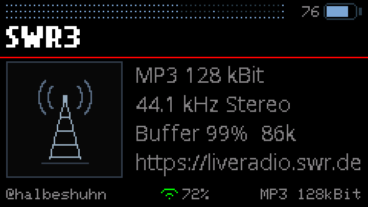
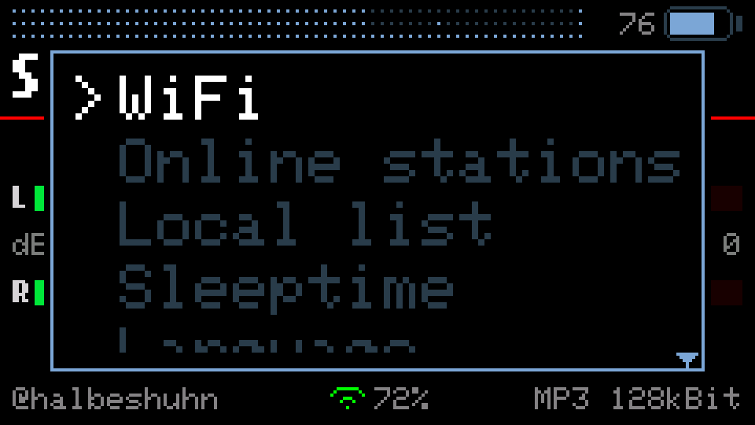

# Cardputer WebRadio v3.4.0

An internet radio for the **M5Stack Cardputer Adv** — one that you never have
to plug into a computer to add a station.

Based on [WuSiU/WebRadio_WuSiU_Cardputer_Adv](https://github.com/WuSiU/WebRadio_WuSiU_Cardputer_Adv),
which is based on [cyberwisk/M5Cardputer_WebRadio](https://github.com/cyberwisk/M5Cardputer_WebRadio).

---

## The point: the SD card can stay where it is

Every Cardputer radio I know of works like this. You want a new station, so you
power the device down, pull the microSD card, find a card reader, search the web
for a stream URL that actually works, paste it into a text file, put the card
back, and hope you got the format right. Repeat for every station.

**This one has the station directory built in — and a search field.**

Press `BtnG0` → **Online stations**, type three letters, and you are looking at
the stations you meant. 240 countries, every station
[radio-browser.info](https://www.radio-browser.info/) knows. Pick one, press
`ENTER`, it plays. Like it? Open the menu again and choose **Save station**: it
lands in your own list on the SD card, written by the device itself.

| | |
|---|---|
|  |  |
| 240 countries… | …three keystrokes later |

The same for stations: type, and the directory searches — on the server, not
here, because only eleven names fit in this device's memory at a time.

| | |
|---|---|
|  |  |

---

## New in 3.4.0

- **https stations play — over real TLS.** Not rewritten to http, not
  side-stepped: the radio opens a TLS connection and streams through it. The
  whole Swiss SRG family, which was simply unreachable before, plays; so does
  Deutschlandfunk, and Radio SRF 3 in AAC+. Everything the previous release said
  about `https not work` is gone from the code and from the footer.
- **A dropout is silence now, not a rattle.** When the network stalls, the I2S
  output used to repeat its last 26 ms of audio in a loop — that is the rattling
  every listener knows. Two changes end it: the output falls silent when nothing
  is fed to it, and the decoder is **paused** below 8 KB of buffer instead of
  eating every byte the moment it arrives. It resumes at 24 KB, with a real
  head start. If nothing comes back for eight seconds, the footer says
  `Stream stopped - no data` and the radio reconnects on its own.
  The idea of pausing the decoder instead of starving it comes from
  **[Heotsan](https://github.com/Heotsan)**, who described it in
  [issue #3](https://github.com/halbeshuhn/Cardputer-WebRadio/issues/3) —
  thank you.
- **The volume control is even now.** Every press changes the level by the same
  1.9 dB, all the way up. It used to be wildly lopsided: the first audible step
  was 6 dB, the last one 0.42 dB, and four presses out of twenty-six did nothing
  at all. The cause was the audio library, which keeps its gain in a `uint8_t` —
  64 steps between silence and full, spaced linearly in amplitude while the ear
  hears in decibels. The radio no longer uses it and scales the samples itself.
- **A charge screen.** Menu entry *Charge Mode*: stream, watchdog and the **Wi-Fi
  radio** go off, the CPU drops to 80 MHz, the charge level stands in large
  digits, and after five seconds the display goes dark. Any key shows it again,
  only `BtnG0` leaves. For a device that spends the night on a charger.
- **The screen stopped flickering.** Menus, the info screen and the equalizer
  labels used to clear their area and then redraw it; the display has no back
  buffer, so the gap between those two steps was visible. Now everything paints
  opaque over its own background and only clears the overhang.
- **Long names and addresses scroll** instead of being cut off — station name,
  stream title and the full stream address on the info screen, complete with
  scheme and path. The selected equalizer band and the volume scale breathe
  while you work them.
- **No more thump when a station starts.** 500 ms of silence, then a two-second
  linear fade-in. The connect noise of the decoder finding its first frame
  happens behind that.
- **Keyboard shortcuts** on the radio screen: `v` cycles the meters, `i` the info
  screen, `e` the equalizer, `w` Wi-Fi, `l` the local list, `o` the online
  directory, `s` the sleep timer. `f` still walks through all six states, and the
  system menu is untouched — the letters are a second way, not a replacement.
- **No stutter at the start of a stream.** The pre-buffer is 56 KB, requested
  before anything else and **filled before the first sample is played**. Twelve
  starts in a row came up at full size.
- **An escape hatch for streams the decoder cannot read.** An AAC stream fed to
  the MP3 decoder used to lock the device up completely — it searched for a valid
  frame inside a single `loop()` call and never came back. Ten underruns in three
  seconds now end the stream instead.
- **27 KB less flash and 11 KB fewer global variables**, while all of the above
  was added. The M5Launcher leaves **56 KB free** now, up from 29 KB. Most of it
  comes from rebuilt ESP-IDF libraries, see
  [`library-patch/idf-libs/`](library-patch/idf-libs/).
- **The equalizer was redrawn.** Wider columns, the dB scale on the left removed,
  and the pre-attenuation is now a half-width column of its own with its own
  finer grid — it is a different kind of control, so it looks like one.
- **The system menu has a fixed window** and scrolls by the pixel, with a
  half-cut row at the bottom as the hint that there is more.
- **The battery says a number**, next to the symbol.

### Fixed in 3.4.0

- **An undecodable stream froze the device.** Found with Radio SRF 3, whose AAC
  stream reached the MP3 decoder because the content type said otherwise. See
  the escape hatch above; the codec is now also read out of the address when the
  header is unhelpful.
- **VU meters and the spectrum drew into open lists.** Five places check whether
  an overlay is on screen; one of them did not.
- **Every logo download waited out its eight-second deadline.** The read loop had
  no completion test: the server keeps the connection alive, `available()`
  returns 0, `connected()` stays true. The data was there after 75 ms. Every
  time, for every station.
- **`.ico` logos were downloaded and then thrown away.** The type check accepted
  anything called `image`. Now only `image/png` and `image/jpeg` get past the
  header, and the rest is dropped without a byte transferred.
- **The stream watchdog started its clock too early** for stations that redirect
  more than once.

### Before that, in 3.3.0

- **A sleep timer**, set as `HH:MM` up to twelve hours, counting down in the
  footer; at zero the stream stops and the display goes dark, and any key brings
  it all back.
- **Playlists are resolved instead of refused** — `.pls` and plain `.m3u` carry
  the real stream address, and the radio now reads it.
- **Station logos**, fetched once and kept on the SD card in `/logos`.
- **An info screen** with codec, bitrate, sample rate, channels, buffer fill,
  free memory and the host the audio really comes from.
- **59 KB of memory back** by taking SBR out of the AAC decoder — the change that
  made everything since possible.
- **Wi-Fi failures under M5Launcher fixed.** M5Launcher up to 2.8.0 lays out a
  smaller shared NVS area (`0x4000` instead of `0x5000`) than the Wi-Fi driver
  expects to write into. The radio now calls `WiFi.persistent(false)` before its
  first Wi-Fi call, so the driver keeps its configuration in RAM.

### Before that, in 3.2.0

- **A 5-band equalizer**, ±6 dB at 100 Hz, 350 Hz, 1 kHz, 3.5 kHz and 10 kHz,
  stored on the device and active from the next start.
- **Foreign scripts are displayed.** Chinese, Japanese, Korean, Greek, Cyrillic —
  station names and stream titles arrive as UTF-8 and are drawn with the
  matching font. Until now everything beyond Latin-1 became a row of `?`.
- **240 countries instead of 42**, with a **search field** on the country page.
- **A search field for stations**, invisible until you type.
- **Playlists are recognised** instead of played as noise: a station that serves
  HLS or `.m3u` says so in the footer, and HLS stations are skipped when the
  list is read — in Taiwan that is 18 % of them.
- The regional subdivision is gone. The directory leaves the state empty for
  more than half of all German stations, so it hid more than it showed.

---

## The screens

| | |
|---|---|
|  |  |
| VU meters with peak hold | Spectrum analyzer, VFD style |
|  |  |
| 5-band equalizer | Stream title, with umlauts and accents |
|  |  |
| Info screen with the station logo | Sleep timer, `HH:MM` |

These are not photographs. They are rendered from this repository's own source
by [`tools/`](tools/README.md), which reads the coordinates, labels and colours
out of the sketch — so they cannot drift away from what the device draws.

The info screen above shows the **placeholder** logo, the one the device draws
itself when a station has none, when the fetch fails, or when memory is too
tight for the PNG decoder. Real station logos belong to their stations, so they
are not shipped here — your device fetches them.

### If a station in your list has no logo

The radio can only fetch a logo it has an address for, and that address comes
from the online directory. A station that exists **only** in your own
`station_list.txt`, and that you never played from the directory, therefore
keeps the placeholder for good.

You can give it one by hand, and there is a tool for exactly that:
**[Station logo → .565](https://halbeshuhn.github.io/Cardputer-WebRadio/v3.4.0/tools/logo565.html)**
— it runs in the browser, installs nothing, and uploads nothing. Paste the
stream URL, drop an image in, fit it into the square, press the button. The
file lands in your downloads named `A1B2C3D4.565`; copy it to `/logos/` on the
card and the station has its picture from the next start.

The name is the FNV-1a hash of the stream URL — the same one the device
computes when it looks for the picture — and the bytes are RGB565 little-endian
at 76 × 76. Both are easy to get wrong by hand; the page gets them right.
Details, and the ffmpeg command for doing it yourself, are in
[`tools/`](tools/README.md).

---

## Operating it

The Cardputer has no cursor keys. The four keys `;` `.` `,` `/` are the arrows,
and this text calls them **up, down, left, right**. `` ` `` is **ESC**.

### Radio screen

| Key | Does |
|---|---|
| **up / down** | volume |
| **left / right** | previous / next station in the local list |
| **`M`** | mute |
| **`F`** | next display: off → VU → VU with peak → spectrum → **equalizer** → **info** → off |
| **`B`** | display brightness |
| **`R`** | play `/mp3` files from the SD card |
| **`BtnG0`** | system menu |

Since 3.4.0 the places you go often have a letter of their own, so you do not
have to walk there:

| Key | Goes to |
|---|---|
| **`v`** | the meters — VU → VU with peak → spectrum → VU |
| **`i`** | the info screen |
| **`e`** | the equalizer |
| **`w`** | Wi-Fi, straight into the network list |
| **`l`** | the local station list |
| **`o`** | the online directory, country page first |
| **`s`** | the sleep timer — and if one is running, `s` stops it |

These work on the radio screen and inside the equalizer. They deliberately do
**not** work where you are typing: the country and station search fields, the
local list, the system menu and the sleep timer entry each have their own keys.

While a sleep timer runs, the remaining time replaces the handle in the footer,
in yellow: `01:27 .zZ`. Once it has fired, the device is silent and dark but
still on — **any key** brings it back.

With the display **off**, the stream title stands below the red rule — four
lines, wrapped at word boundaries. It waits while the input buffer is low: the
sound has priority.

### Equalizer

Reached with `F`, right after the spectrum.

| Key | Does |
|---|---|
| **up / down** | raise or lower the selected band, 1 dB per press |
| **left / right** | choose a band |
| **`0`** | all bands back to zero |
| **`F`** | leave, and save |
| **`M`, `B`** | still work |

At the ends nothing wraps around: the selection stops at 100 Hz and at 10 kHz,
the value at +6 and −6 dB. The setting is written to NVS when you leave and
after two seconds without a keypress — never on every keystroke, because a
write to flash stops the loop that feeds the audio buffer.

The curve is **active immediately after switching on**. An equalizer is a
setting, not an effect you have to enable.

### System menu (`BtnG0`)

| Entry | Does |
|---|---|
| **WiFi** | scan, connect, forget; up to five networks are remembered |
| **Online stations** | the directory — see below |
| **Local list** | the stations on your SD card |
| **Save station** | appears only while an online station is playing |
| **Sleeptime** | the sleep timer — see below. Once it runs, the same entry reads **Sleep -> STOP** |
| **Language** | German or English, remembered |
| **Charge Mode** | the charge screen — see below |
| **Exit** | back to the radio |

Up and down choose, `ENTER` opens, `` ` `` (ESC) closes. The window has a fixed
height and scrolls by the pixel; the row at the bottom edge is deliberately cut
in half, because a half-visible row says *there is more* better than any arrow.

### Charge Mode

`BtnG0` → **Charge Mode**, for a device sitting on a charger. Everything that
draws current stops: the stream, the stream watchdog, and the **Wi-Fi radio**,
which is the biggest consumer of the three. The CPU drops to 80 MHz.

What stays is the charge level in large digits and one line under it. After five
seconds the display goes dark; any key brings it back for another five. **Only
`BtnG0` leaves** — a key brushed by accident should not put the radio back on
air.

Leaving costs the usual wait for Wi-Fi and for the station to start, because
both were genuinely switched off. That is the deal: maximum saving, slower
return.

The idea comes from the M5Launcher's own charge screen, which dims and drops the
clock. This one goes further because it has a radio to switch off.

One warning, unrelated but the same button: `BtnG0` **held down at boot** clears
the saved Wi-Fi networks.

### Sleep timer

`BtnG0` → **Sleeptime**. The time is set digit by digit, up to `12:00`:

| Key | Does |
|---|---|
| **left / right** | choose the field — hours, tens of minutes, single minutes |
| **up / down** | count that field up or down; nothing wraps or carries |
| **`ENTER`** | start |
| **`M`, `B`** | mute and brightness stay reachable |
| **`` ` ``, backspace** | back without starting |

The hours share one underline across both digits, each minute digit has its own.
While the timer runs the footer counts down in yellow:

At zero the stream is stopped and the display goes dark — the device stays on,
it simply falls silent. The stream watchdog is suspended for that time, because
otherwise it would treat the stopped stream as a dead one and reconnect within
seconds. **Any key** wakes the device: brightness returns to the level it had
and the station is dialled again.

### Online stations

Two levels: country, then station.

| Key | Country page | Station page |
|---|---|---|
| **up / down** | move the selection | move the selection |
| **left / right** | page back / forward | page back / forward |
| **letters, digits** | search — the list narrows as you type | search — the directory is asked |
| **BACKSPACE** | deletes one character, **nothing else** | deletes one character, **nothing else** |
| **`ENTER`** | open the country | play the station |
| **`` ` ``** (ESC) | one level back | one level back |
| **`BtnG0`** | straight back to the radio |

The search field on the station page is **invisible until you type** and
disappears when the last character is deleted; its space stays reserved so the
list does not jump. Top right stands the page number — `3/?` until the last
page has been seen, `3/12` afterwards.

Stations are sorted by popularity, so the well-known ones are on page one. That
matters for scripts you cannot type on this keyboard: nobody can enter 中文 here,
but everyone can look at the first page.

### Local list

| Key | Does |
|---|---|
| **up / down** | choose |
| **`ENTER`** | play |
| **BACKSPACE** | delete this entry |
| **`` ` ``** (ESC) | back to the menu |

The list lives in `/station_list.txt` on the SD card, one station per line as
`Name,URL`, up to 20 of them. **Save station** appends to it.

---

## Flashing

Two prebuilt images are in [`firmware/`](firmware/):

| File | Size | Use with |
|---|---|---|
| `Cardputer-WebRadio_v3.4.0.bin` | 2.9 MB | SD card / M5Launcher — application only |
| `Cardputer-WebRadio_v3.4.0_merged.bin` | 4.2 MB | M5Burner, ESP Web Flasher — write to `0x0` |

On first start the device scans for Wi-Fi networks and asks for a password.
The interface starts in English; switch under **BtnG0 → Language**.

---

## Building it yourself

| Setting | Value |
|---|---|
| Board | **M5Cardputer** |
| Partition Scheme | **Huge APP (3MB No OTA / 1MB SPIFFS)** |
| PSRAM | **Disabled** |

The partition scheme is not optional — the sketch is 2.89 MB, and the M5Launcher
gives an application 2880 KB. PSRAM must stay off: the Cardputer Adv has none,
and enabling it only costs program space.

Libraries: [ESP8266Audio](https://github.com/earlephilhower/ESP8266Audio) and the
M5 libraries (M5Cardputer, M5Unified, M5GFX).

**Five changes to the toolchain are required**, all documented with before/after
copies in [`library-patch/`](library-patch/):

| | What | Without it |
|---|---|---|
| `aac-sbr-aus/` | SBR out of the AAC decoder | 59 KB of heap gone; the build stops with an `#error` |
| `http-tls/` | TLS in the audio stream | every https station fails to connect |
| `prefill/` | fill the buffer before playing, plus the escape hatch | stutter at every start; an undecodable stream freezes the device |
| `i2s-stille/` | silence instead of repeating the last DMA block | every dropout rattles |
| `idf-libs/` | rebuilt ESP-IDF libraries, asymmetric mbedTLS buffers | https handshakes do not fit in the largest free block |

Only the first one is enforced: the sketch **refuses to compile** without it. The
other four fail later and more quietly, which is why they are spelled out here.
The last is the longest job — read
[`library-patch/idf-libs/README.md`](library-patch/idf-libs/README.md) before
starting it.

If you only want to flash the firmware, you do not need any of this — the images
in [`firmware/`](firmware/) are built with all five applied.

---

## Limitations, and why

This device has **no PSRAM**. Everything — the audio buffer, the decoder, the
TLS connection, the PNG decoder for a station logo — comes out of one pot of
about 250 KB, and what matters is rarely the total. It is the **largest
contiguous block**, and that is the number the rest of this section is about.

### https works, and it costs almost everything

**The radio speaks TLS now.** Not rewritten, not side-stepped — a real
handshake, a real encrypted stream. The previous release rewrote `https://` to
`http://` and hoped the station would serve both; that trick is gone, along with
the `https not work` message, because there is nothing left to work around.

Getting there took three things, and it is worth knowing what they cost:

| | free heap | largest block |
|---|---:|---:|
| at boot | 250,260 | 196,596 |
| running, http station | 129–134 KB | 86,004 |
| with the TLS context held open | 96–101 KB | 55,284 |
| **running, https station** | **13.8–28.5 KB** | **7,668–9,716** |

The lowest free heap seen during an https stream was **5,480 bytes**. Nothing
crashed, and nothing is left over either.

- **Rebuilt ESP-IDF libraries.** mbedTLS reserves two 16 KB record buffers by
  default. Outgoing records never exceeded 1,568 bytes across 44 https stations
  measured, so the outgoing buffer is 2 KB — 14,964 bytes saved at the handshake,
  measured A/B on the device. See
  [`library-patch/idf-libs/`](library-patch/idf-libs/).
- **One TLS context, opened at boot and never closed.** A handshake takes 30 to
  43 KB in one piece. Allocating and freeing that per station would carve the
  heap into pieces nothing else fits into; holding it costs a known 32 KB
  instead. `TLS_DAUERTOPF` in the sketch, on by default.
- **A patch to the audio library**, which opens its own HTTP client internally
  and had no way to be handed a TLS one. See
  [`library-patch/http-tls/`](library-patch/http-tls/).

**One rule worth knowing if you build on this:** `HTTPClient` refuses a redirect
that changes the scheme — `setURL()` stops with *new URL not the same protocol*,
because the client was bound at `begin()`. A plain client cannot do https and a
TLS client cannot do plain http. The sketch therefore intercepts scheme changes
itself and knocks on the new door with the right client; same-scheme redirects
are still followed by the library.

Two things are still unexplained, and are written down rather than glossed over:
why an https `open()` sometimes takes 43 KB instead of the expected 19–21, and
why the ceiling drops by about 24 KB once per session and stays down.

### Playlists are resolved, HLS is not

Two different things are called a playlist, and only one of them can be
resolved.

`.pls` and plain `.m3u` contain the real stream address — `File1=http://...`
or simply one bare URL per line. The radio reads the first playable one and
connects to it. Quoted values are handled, `https` entries are skipped in favour
of a later `http` one, and lines longer than the buffer are ignored rather than
truncated into a wrong address.

`.m3u8`/HLS contains no stream address at all, only a list of segments —
`media_649.ts`, `media_650.ts` — that would have to be re-fetched every ten
seconds and stitched together, with an MPEG-TS demuxer behind it. That is what
ffmpeg does inside mpv or VLC, and it does not fit here. Those stations are
skipped when the list is read (the directory marks them), and if you reach one
anyway the footer says `HLS - not supported`.

Measured on 14 August 2026: among the 250 most-clicked German stations not a
single playlist arrives, because the directory already resolves them. Among 120
Taiwanese stations 21 do, and all 21 were HLS. The resolver therefore earns its
keep on hand-entered stations, not on the directory.

### AAC+ plays its base layer

SBR — the “+” — is **taken out of the decoder on purpose** since 3.3.0. It was
being compiled in and never used: the radio has played the base layer only since
day one, because SBR's own state wants another 50 KB this device does not have.
Compiling it in cost 59 KB of workspace for nothing.

Measured with the device's own toolchain: the AAC decoder needs 89,428 bytes
with SBR and 26,352 without, so the shared decoder workspace shrank from 90,048
to 30,720 bytes — MP3 gives the number now, not AAC. Those 59 KB are what the
station logos are made of.

AAC+ therefore plays at 22,050 Hz instead of 44,100 and mono where parametric
stereo is used. Stable, just duller — exactly as before, only now the memory is
spent on something. Plain AAC-LC is unaffected.

**This needs a one-time patch to the audio library**, three lines in two files
plus one condition in a third. It is in [`library-patch/`](library-patch/) with
before/after copies and a `.patch` file. Without it the sketch stops at compile
time with an `#error` rather than failing on the device.

### The output is mono

The Cardputer Adv has an ES8311, a **mono** codec — one DAC, for the speaker and
for the 3.5 mm jack alike. Both channels are averaged before output, so nothing
that a station puts hard left or right is lost. The VU meters still show both
channels: they measure before that point.

### Not every script

Chinese, Japanese, Korean, Greek, Cyrillic and Latin are covered. Arabic and
Hebrew need right-to-left, Thai and the Indic scripts need reordering and
stacking — that is a text engine, not a font, and this device does not have one.

Stream titles that arrive in a legacy encoding such as Big5 cannot be shown
either; there is no room for conversion tables. Station names in that state are
discarded rather than drawn as boxes — the correct name from the directory stays.

---

## Notes for anyone modifying this

Audio callbacks run in the loop task here, so drawing from them is allowed — but
`ConsumeSample()` **must not modify the sample it is handed**. The library offers
the same sample again when it did not fit into the I2S buffer, and a second pass
over it was audible as a fine crackle.

Round, never truncate, when you scale samples.

**Never clear and then draw.** The panel has no back buffer, so the gap between
`fillRect()` and the text that follows is a frame the eye catches — that is what
the flicker was. Draw text with an opaque background colour
(`setTextColor(fg, bg)`) so it covers its own ground, and clear only the
**overhang**: the strip to the right of a shorter string, the rows above and
below a moved element. The whole area gets cleared once, when the screen
actually changes to a different screen.

`tools/` renders every screen on your computer, reading the coordinates out of
the sketch. Change a `#define`, render again, and you see it — no flashing
needed. See [`tools/README.md`](tools/README.md).

---

## Credits

- **cyberwisk** — [M5Cardputer_WebRadio](https://github.com/cyberwisk/M5Cardputer_WebRadio), the original
- **WuSiU** — [WebRadio_WuSiU_Cardputer_Adv](https://github.com/WuSiU/WebRadio_WuSiU_Cardputer_Adv), the version this one grew out of
- **earlephilhower** — [ESP8266Audio](https://github.com/earlephilhower/ESP8266Audio), which does the decoding since 3.1.2
- **schreibfaul1** — [ESP32-audioI2S](https://github.com/schreibfaul1/ESP32-audioI2S), which carried this radio up to 3.1.1
- **Heotsan** — the rebuffering idea in 3.4.0, from [issue #3](https://github.com/halbeshuhn/Cardputer-WebRadio/issues/3)
- **radio-browser.info** — the station directory
- **M5Stack** — M5Unified, M5GFX and the efont CJK fonts

## License

MIT — see [LICENSE](LICENSE).
